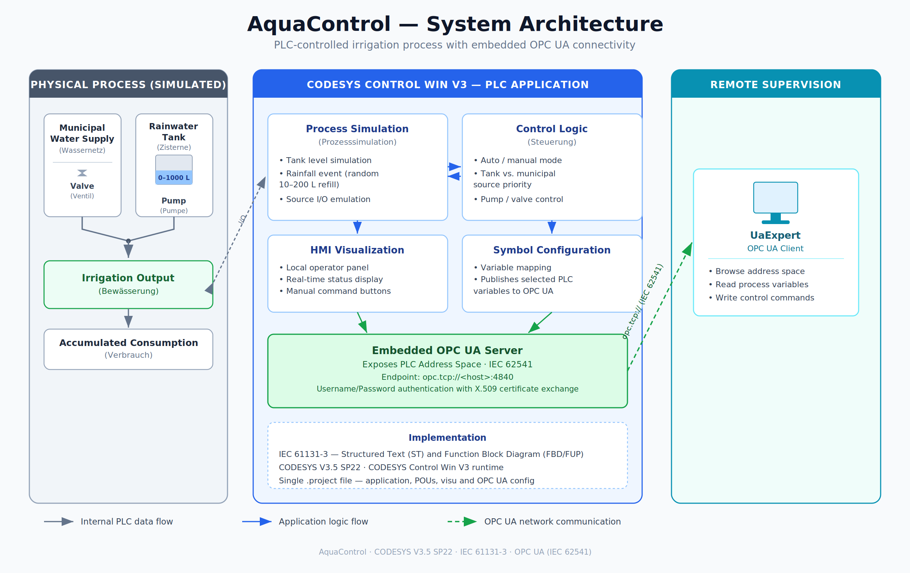
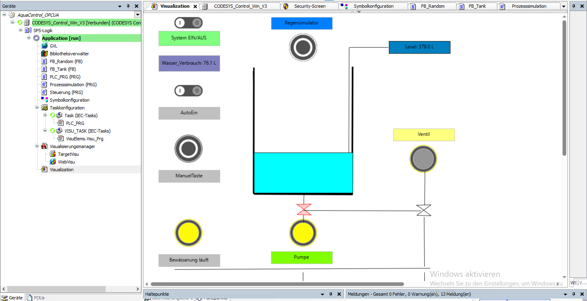
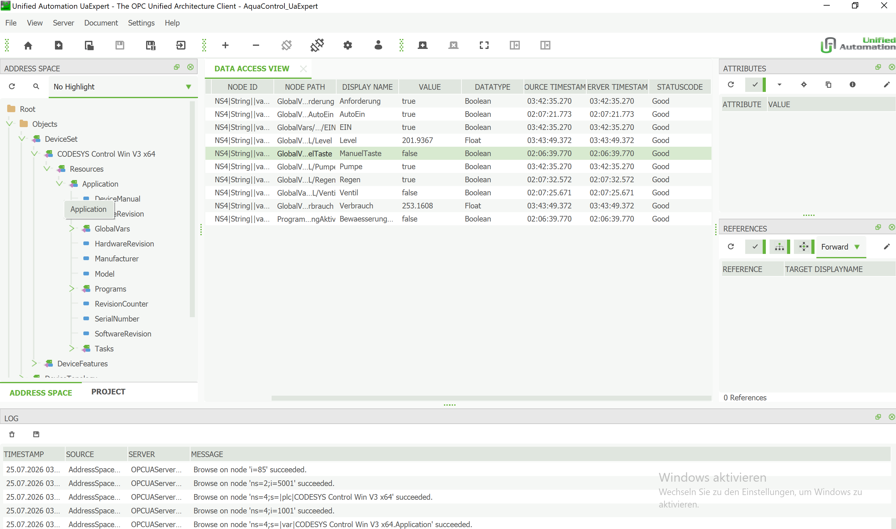

# AquaControl

> Industrial automation project featuring a PLC-controlled irrigation process with integrated OPC UA connectivity.


---

## Overview

AquaControl is an industrial automation project developed with **CODESYS V3.5 SP22** that simulates a PLC-controlled irrigation system with integrated OPC UA connectivity.

The application manages two independent water sources: a **rainwater storage tank -> Pumpe** and **a municipal water supply -> Ventil** and automatically prioritizes the available source during irrigation. The tank level is continuously monitored, total water consumption is accumulated throughout the process, and rainfall can be simulated to dynamically refill the tank with a randomly generated volume of water.

An integrated HMI provides local supervision and control of the process, while an embedded **OPC UA Server** exposes the PLC variables for remote monitoring and interaction through **UaExpert**.

The project combines PLC programming, process simulation, HMI visualization and industrial communication within a single IEC 61131-3 application.

---

## Key Features

- PLC application developed with CODESYS
- IEC 61131-3 based implementation
- Automatic and manual irrigation modes
- Automatic source selection between rainwater and municipal water
- Continuous tank level monitoring
- Rainfall simulation with random tank refill
- Automatic pump and valve control
- Water consumption accumulation
- Integrated HMI visualization
- Embedded OPC UA Server
- Certificate-based OPC UA communication
- Real-time monitoring and control using UaExpert

---

## System Architecture

<p align="center">
    
</p>

The application consists of three main components:

- **PLC Application** implementing the irrigation process logic
- **Embedded OPC UA Server** exposing the PLC Address Space
- **UaExpert OPC UA Client** providing remote supervision and control

---

## Process Overview

The irrigation system operates using two independent water sources.

During normal operation, irrigation is supplied from the rainwater storage tank. As long as water is available, the PLC activates the pump and prioritizes the use of the stored water.

When the tank level reaches zero, the controller automatically switches to the municipal water supply by opening the valve, ensuring uninterrupted operation.

The operator can start irrigation manually or enable automatic mode. A rainfall simulation allows the tank to be refilled with a randomly generated amount of water, reproducing changing environmental conditions during the simulation.

Throughout operation, the PLC continuously updates the tank level and accumulates the total amount of consumed water.

---

## HMI Visualization

<p align="center">
    
</p>

The integrated HMI allows the operator to

- start or stop the irrigation system;
- enable or disable automatic mode;
- trigger manual irrigation;
- simulate rainfall;
- monitor the tank level in real time;
- observe the current pump and valve states;
- monitor the accumulated water consumption.

---

## OPC UA Connectivity

<p align="center">
    
</p>

The embedded OPC UA Server exposes the PLC variables through its Address Space.

Using **UaExpert**, the client can

- browse the OPC UA Address Space;
- read process variables;
- write control variables;
- monitor the irrigation process in real time.

---

## OPC UA Information Model

| Variable | Type | Access | Description |
|----------|------|:------:|-------------|
| `EIN` | BOOL | RW | Main system switch |
| `AutoEin` | BOOL | RW | Automatic operating mode |
| `ManuelTaste` | BOOL | RW | Manual irrigation command |
| `Level` | REAL | R | Rainwater tank level (L) |
| `Pumpe` | BOOL | R | Pump status |
| `Ventil` | BOOL | R | Municipal water valve status |
| `Verbrauch` | REAL | R | Accumulated water consumption (L) |

---

## Repository Structure

```text
AquaControl/
│
├── README.md
├── .gitignore
│
├── plc_server/
│   └── Aqua_Control.project
│
├── plc_client/
│   └── Aqua_Control_UaExpert.uap
│
└── docs/
    ├── architecture/
    │   └── architecture.png
    │
    ├── diagrams/
    │
    └── screenshots/
        ├── HMI.png
        └── UA_Expert.png
```

---

## Technologies

- CODESYS V3.5 SP22
- IEC 61131-3
- Structured Text (ST)
- Function Block Diagram (FBD/FUP)
- OPC UA (IEC 62541)
- UaExpert

---

## Getting Started

1. Open the project located in `plc_server/` using CODESYS.
2. Download the application to the CODESYS Control Win runtime.
3. Start the PLC in **RUN** mode.
4. Open the UaExpert project from `plc_client/`.
5. Connect to the embedded OPC UA Server.
6. Browse the Address Space.
7. Read, write and monitor the exposed process variables.

---

## Demo

https://github.com/user-attachments/assets/b353115c-568e-483c-9320-cfed50007522

---
